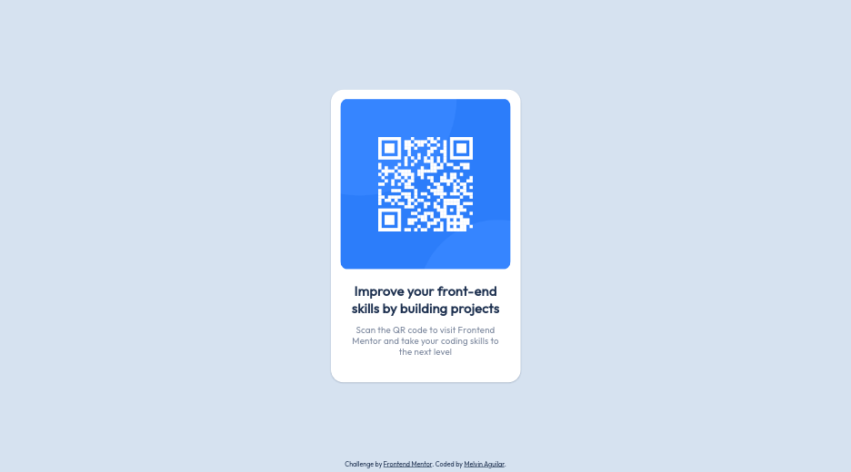

# Frontend Mentor - QR code component solution



This is a solution to the [QR code component challenge on Frontend Mentor](https://www.frontendmentor.io/challenges/qr-code-component-iux_sIO_H). Frontend Mentor challenges help you improve your coding skills by building realistic projects. 

<h2 align="center">Links</h2>

- Solution URL: [QR Code Component (SASS + Flexbox) | Frontend Mentor](https://www.frontendmentor.io/solutions/qr-code-component-sass-flexbox-w20ntizjJs)
- Live Site URL: [https://qr-code-component-hdz.vercel.app/](https://qr-code-component-hdz.vercel.app/)

## Table of contents

- [Overview](#overview)
  - [The challenge](#the-challenge)
  - [Screenshot](#screenshot)
- [My process](#my-process)
  - [Built with](#built-with)
- [Author](#author)
- [Acknowledgments](#acknowledgments)


## My process

### Built with

- Semantic HTML5 markup
- Flexbox
- [SASS](https://sass-lang.com/documentation/modules) - Sass modules

### Useful resources

- [Material Design Box Shadows](https://codepen.io/sdthornton/pen/wBZdXq)

## Author

- Frontend Mentor - [@melvinaguilar](https://www.frontendmentor.io/profile/melvinaguilar)

## Acknowledgments

When using `sass` in order to build this solution

- Install `sass` if not yet installed:

```bash
npm install -g sass
```

- Run build command from command line:

```bash
sass assets/sass/main.scss assets/css/style.css
```

- If you want to edit the code and test, in the root folder of this repository, run this command from the command line:

```bash
sass --watch assets/sass/main.scss assets/css/style.css
```

## File structure

```
.
├── assets
│   ├── css
│   │   ├── style.css
│   │   └── style.css.map
│   ├── images
│   │   ├── favicon-32x32.png
│   │   └── image-qr-code.png
│   └── sass
│       ├── abstract
│       │   ├── _mixins.scss
│       │   └── _variables.scss
│       ├── base
│       │   ├── _page.scss
│       │   └── _reset.scss
│       ├── component
│       │   ├── _attribution.scss
│       │   ├── _card.scss
│       │   └── _heading.scss
│       ├── layout
│       │   └── _main-section.scss
│       └── main.scss
├── design
│   ├── desktop-design.jpg
│   ├── desktop-preview.jpg
│   ├── mobile-design.jpg
│   └── screenshot.png
├── index.html
└── README.md
```